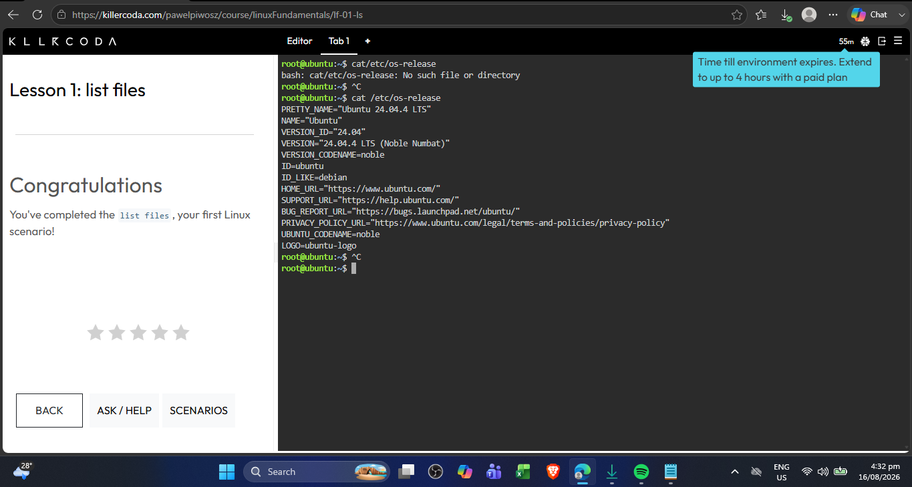
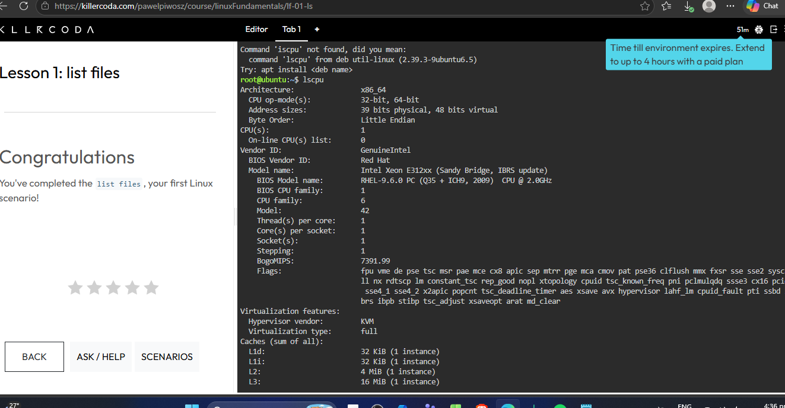
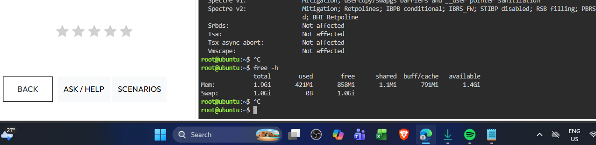
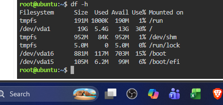

# Laboratory 03 – Multi-Cloud Explorer

## Mission 3: Become a Multi-Cloud Explorer

This laboratory activity explores and compares three major cloud computing platforms:

* Amazon Web Services (AWS)
* Microsoft Azure
* Google Cloud Platform (GCP)

The purpose of this mission is to investigate their core services, compare their capabilities, and recommend appropriate cloud platforms based on different business requirements.

## Objectives

* Explore major public cloud platforms.
* Identify core services offered by AWS, Azure, and GCP.
* Compare cloud services across different providers.
* Analyze business requirements and recommend suitable cloud solutions.
* Practice technical documentation using Markdown.
* Continue developing a GitHub Cloud Computing Portfolio.

## Cloud Platforms

### Amazon Web Services (AWS)

AWS is a cloud computing platform that provides services for computing, storage, networking, databases, security, artificial intelligence, and many other workloads.

### Microsoft Azure

Microsoft Azure is a cloud computing platform that provides computing, storage, networking, databases, identity, AI, and enterprise services.

### Google Cloud Platform (GCP)

Google Cloud Platform provides cloud infrastructure and services for computing, storage, networking, databases, artificial intelligence, machine learning, and Kubernetes.

## Mission Checkpoints

* Checkpoint 1 – Expand Your Cloud Portfolio
* Checkpoint 2 – Explore the Three Cloud Platforms
* Checkpoint 3 – Compare the Major Cloud Platforms
* Checkpoint 4 – Cloud Platform Recommendation Challenge
* Checkpoint 5 – Match the Cloud Services
* Checkpoint 6 – Multi-Cloud Decision Matrix
* Checkpoint 7 – Continue Your Linux Investigation
* Checkpoint 8 – Mission Reflection


# Checkpoint 7 – Continue Your Linux Investigation

## Linux Server Investigation

A Linux server was investigated using the KillerCoda Playground. Linux commands were used to identify the operating system, CPU information, memory, and disk space.

## Operating System

The following command was used:

```bash
cat /etc/os-release
```

The Linux server is running **Ubuntu 24.04.4 LTS**, with version ID **24.04** and codename **Noble Numbat**.

### Screenshot



## CPU Information

The following command was used:

```bash
lscpu
```

The server uses an **x86_64** architecture and has **1 CPU**. The CPU is an **Intel Xeon E312xx (Sandy Bridge, IBRS update)** with a reported frequency of **2.0 GHz**. The system has **1 core and 1 thread per core**.

### Screenshot



## Memory

The following command was used:

```bash
free -h
```

The server has **1.9 GiB of total memory**. At the time of the investigation, **421 MiB was used**, **858 MiB was free**, and **1.4 GiB was available**. The system also has **1.0 GiB of swap space**, with 0 B currently being used.

### Screenshot



## Disk Space

The following command was used:

```bash
df -h
```

The main filesystem `/dev/vda1` has **19 GiB of total space**, with **5.4 GiB used** and **13 GiB available**. The main filesystem is currently using approximately **30%** of its available disk space.

### Screenshot



## Linux Server Summary

| Category         | Result             |
| ---------------- | ------------------ |
| Operating System | Ubuntu 24.04.4 LTS |
| Architecture     | x86_64             |
| CPU              | Intel Xeon E312xx  |
| CPU Count        | 1                  |
| Memory           | 1.9 GiB            |
| Available Memory | 1.4 GiB            |
| Main Disk        | 19 GiB             |
| Disk Used        | 5.4 GiB            |
| Disk Available   | 13 GiB             |
| Disk Usage       | 30%                |

## Cloud Migration

If this Linux server were migrated to the cloud, it could be hosted using virtual machine services from AWS, Microsoft Azure, or Google Cloud Platform.

| Cloud Provider  | Cloud Service          | Purpose                                       |
| --------------- | ---------------------- | --------------------------------------------- |
| AWS             | Amazon EC2             | Hosts Linux virtual machines and applications |
| Microsoft Azure | Azure Virtual Machines | Runs Linux-based virtual machines in Azure    |
| GCP             | Compute Engine         | Runs Linux virtual machines on Google Cloud   |

### AWS – Amazon EC2

Amazon EC2 can host the Linux server as a virtual machine. The operating system, CPU, memory, storage, and other resources can be configured using an appropriate EC2 instance.

### Microsoft Azure – Azure Virtual Machines

Azure Virtual Machines can host the Linux server and support Linux operating systems. The virtual machine can be configured according to the CPU, memory, storage, and application requirements of the workload.

### GCP – Compute Engine

Google Cloud Compute Engine can also host the Linux server as a virtual machine. CPU, memory, storage, and operating system configurations can be selected based on the workload requirements.

## Conclusion

The Linux server can be migrated to any of the three major cloud platforms because AWS, Azure, and GCP all provide virtual machine services capable of running Linux workloads. The final platform selection would depend on factors such as cost, performance, existing infrastructure, required services, and the organization's business requirements.

