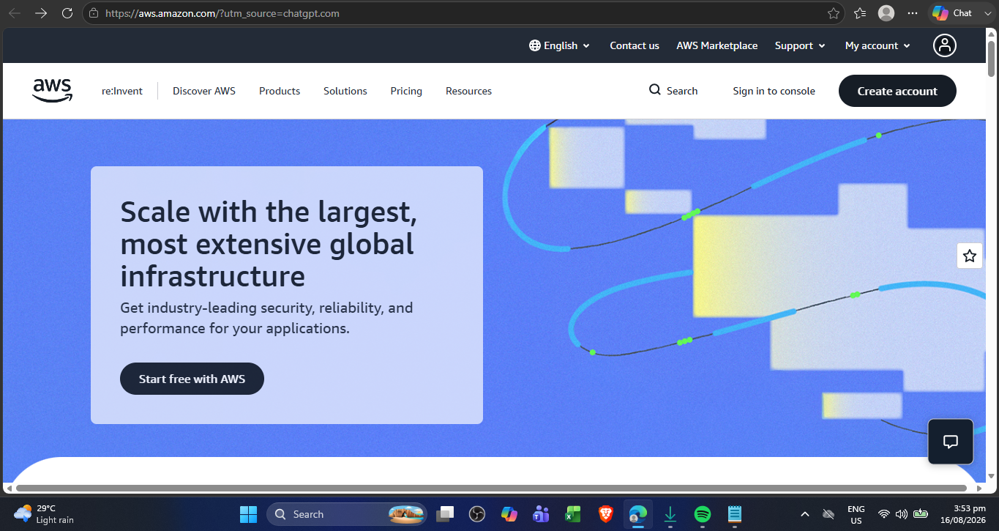

# AWS Research

## Brief Overview

Amazon Web Services (AWS) is a cloud computing platform that provides a wide range of services for computing, storage, databases, networking, security, artificial intelligence, and application development. AWS allows organizations to access computing resources through the internet without having to build and maintain all physical infrastructure themselves.

## Global Infrastructure

AWS operates its cloud infrastructure through geographic Regions and Availability Zones. An AWS Region is a separate geographic area, while Availability Zones are isolated locations within a Region. AWS recommends using multiple Availability Zones when designing highly available applications because a failure in one Availability Zone does not necessarily affect the others.

## Cloud Management Console

The AWS Management Console is a web-based interface used to create, configure, monitor, and manage AWS resources. Users can access services such as EC2, S3, RDS, and VPC through the console. The console provides a graphical interface that makes it easier to manage cloud resources without using only command-line tools.

## Four Core Services

### 1. Amazon EC2

Amazon Elastic Compute Cloud (EC2) provides virtual servers that can be used to run applications and operating systems in the cloud.

### 2. Amazon S3

Amazon Simple Storage Service (S3) is an object storage service used to store and retrieve files, data, backups, and other objects.

### 3. Amazon RDS

Amazon Relational Database Service (RDS) makes it easier to set up, operate, and scale relational databases in the cloud.

### 4. Amazon VPC

Amazon Virtual Private Cloud (VPC) allows organizations to create a logically isolated network where AWS resources can be deployed and securely connected.

## Three Advantages

1. **Wide range of services** – AWS provides many services covering computing, storage, databases, networking, security, analytics, and artificial intelligence.
2. **Global infrastructure** – AWS provides infrastructure in many geographic locations, allowing organizations to deploy applications closer to their users.
3. **Scalability and flexibility** – Organizations can increase or decrease cloud resources according to their workload requirements.

## Typical Enterprise Use Cases

AWS is commonly used for web applications, mobile applications, enterprise applications, data storage, backup and disaster recovery, e-commerce platforms, analytics, and large-scale cloud infrastructure.

## Screenshot Evidence

**Screenshot:** AWS official homepage or AWS Management Console.
