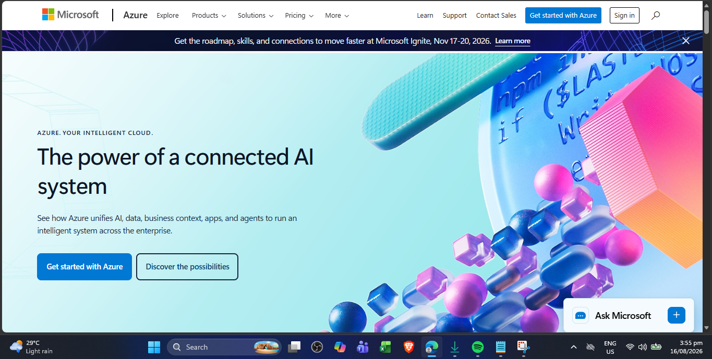

# Microsoft Azure Research

## Brief Overview

Microsoft Azure is a public cloud computing platform developed by Microsoft. It provides services for computing, storage, databases, networking, identity, artificial intelligence, analytics, and application development. Azure is widely used by organizations that already use Microsoft technologies and services.

## Global Infrastructure

Azure operates through a global network of Regions and Availability Zones. An Azure Region contains physical datacenters and networking infrastructure. Many Azure regions provide Availability Zones, which are separated groups of datacenters designed to provide redundancy and fault isolation.

## Cloud Management Console

The Azure portal is a web-based management console used to create, configure, monitor, and manage Azure resources. Users can use the portal to manage virtual machines, databases, storage accounts, networks, applications, and other cloud services. The portal also provides dashboards, search features, resource management tools, and monitoring capabilities.

## Four Core Services

### 1. Azure Virtual Machines

Azure Virtual Machines provide scalable virtual servers that can run Windows or Linux operating systems in the cloud.

### 2. Azure Blob Storage

Azure Blob Storage is an object storage service designed to store large amounts of unstructured data such as documents, images, videos, backups, and application data.

### 3. Azure SQL Database

Azure SQL Database is a managed relational database service based on Microsoft SQL technologies. It allows organizations to run databases without managing the underlying database infrastructure manually.

### 4. Azure Virtual Network

Azure Virtual Network allows cloud resources to communicate securely with each other, the internet, and on-premises networks.

## Three Advantages

1. **Microsoft integration** – Azure integrates strongly with Microsoft technologies such as Windows Server, Microsoft 365, Active Directory, and SQL Server.
2. **Enterprise capabilities** – Azure provides services for security, identity, compliance, networking, databases, and enterprise application workloads.
3. **Global infrastructure** – Azure provides cloud infrastructure across many geographic regions, supporting global applications and disaster recovery strategies.

## Typical Enterprise Use Cases

Azure is commonly used for enterprise applications, Windows Server workloads, Microsoft 365 environments, database systems, hybrid cloud deployments, business applications, virtual desktops, backup and disaster recovery, and artificial intelligence solutions.

## Screenshot Evidence

**Screenshot:** Microsoft Azure official homepage or Azure Portal.

