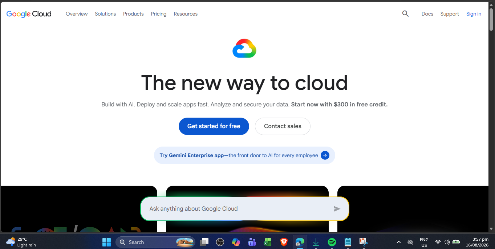

# Google Cloud Platform Research

## Brief Overview

Google Cloud Platform (GCP), commonly called Google Cloud, is a public cloud computing platform developed by Google. It provides services for computing, storage, databases, networking, artificial intelligence, machine learning, data analytics, security, and application development.

## Global Infrastructure

Google Cloud organizes its infrastructure into Regions and Zones. A Region is an independent geographic area that contains multiple Zones. Organizations can distribute resources across different zones or regions to improve availability, resilience, and fault tolerance.

## Cloud Management Console

The Google Cloud console is a web-based interface used to manage Google Cloud resources and services. Users can use the console to create and manage virtual machines, storage, databases, networks, Kubernetes clusters, and other cloud resources. Google Cloud also provides Cloud Shell and command-line tools for managing resources.

## Four Core Services

### 1. Compute Engine

Compute Engine provides virtual machines that allow organizations to run applications and operating systems on Google's cloud infrastructure.

### 2. Cloud Storage

Cloud Storage is an object storage service used to store and retrieve files, backups, application data, media, and other objects.

### 3. Cloud SQL

Cloud SQL is a managed relational database service that supports common database engines and reduces the need for organizations to manage database infrastructure manually.

### 4. Virtual Private Cloud (VPC)

Google Cloud VPC provides networking capabilities that allow cloud resources to communicate securely within a virtual network.

## Three Advantages

1. **Strong AI and machine learning capabilities** – Google provides powerful technologies and services for artificial intelligence, machine learning, and data analytics.
2. **Kubernetes expertise** – Google created Kubernetes and provides Google Kubernetes Engine (GKE) for running containerized applications.
3. **Data and analytics capabilities** – Google Cloud provides services designed for large-scale data processing, analytics, and machine learning workloads.

## Typical Enterprise Use Cases

Google Cloud is commonly used for artificial intelligence and machine learning, data analytics, containerized applications, Kubernetes deployments, web applications, application development, research workloads, and large-scale data processing.

## Screenshot Evidence

**Screenshot:** Google Cloud official homepage or Google Cloud Console.

